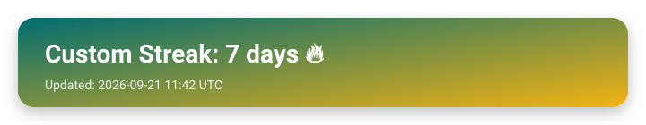

<!-- =======================================================
  LucasLydio • GitHub Profile README (Backend-focused)
  - Uses Markdown + lightweight HTML for layout
  - Icons from Devicon (https://devicon.dev/)
  - Replace: YOUR_LINKEDIN, YOUR_PORTFOLIO, YOUR_EMAIL
======================================================= -->

  <h1>Lucas Lydio 👋</h1>
  

    <b>Backend-focused Developer</b> • Node.js + TypeScript • Building reliable APIs & clean architectures
  

  

    
    
    
  

  

    
    
    
  

---

## 🧠 About me

- Backend-first mindset: **clean services**, **typed contracts**, **secure auth**, **scalable APIs**
- I ship full-stack when needed, but my sweet spot is **Node.js + TypeScript** (Prisma, Redis, JWT, Postgres/Supabase)
- I care about: **DX**, **observability**, **performance**, and **simple maintainable code**

---

## 🧰 Most used technologies

<!-- Core -->

 

<!-- Web / Front (when needed) -->

  
    Also: JWT auth • REST APIs • shadcn/ui • Tailwind • Dockerized environments • Redis caching
  

---

## ⭐ Featured projects

<table>
  <tr>
    <td width="50%">
      <h3>🧩 Forms (Full Stack)</h3>
      

        React (TSX) + Vite • Node.js + TypeScript • Typed forms & submissions flow
      

      

        <a href="https://github.com/LucasLydio/forms-frontend.git"><b>Repository</b></a> •
        <a href="#"><b>Live</b></a>
      

      

        Highlights: auth, validations, clean API contracts, modular services
      

    </td>
    <td width="50%">
      <h3>🟩 Info Tech Web (Full Stack)</h3>
      

        Angular • Node.js • Platform-style app with clean modules & services
      

      

        <a href="https://github.com/LucasLydio/infoTechWeb.git"><b>Repository</b></a> •
        <a href="#"><b>Live</b></a>
      

      

        Highlights: scalable structure, feature modules, REST patterns
      

    </td>
  </tr>
</table>

---

## ✅ Backend principles I follow

- **Type-safe flows** (DTOs, typed responses, consistent error handling)
- **Clean architecture** (controllers → services → data layer)
- **Security first** (JWT/session strategies, validation, rate-limit ready)
- **Performance** (pagination, caching with Redis, good indexes)
- **DX** (scripts, env examples, Docker, predictable setup)

---

## 📈 GitHub stats

  

---

## 🤝 Contact

- Portfolio: **https://lucaslydio-portifolio.netlify.app/**
- LinkedIn: **https://www.linkedin.com/in/lucas-lydio-8231b436b/**
- Email: **lucaslydiotelecom@gmail.com**

  Backend-first • clean APIs • strong typing • consistent delivery

